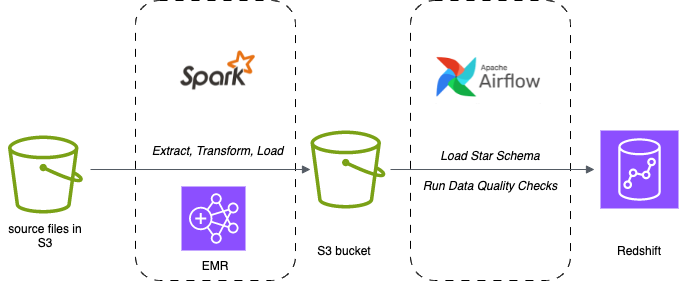
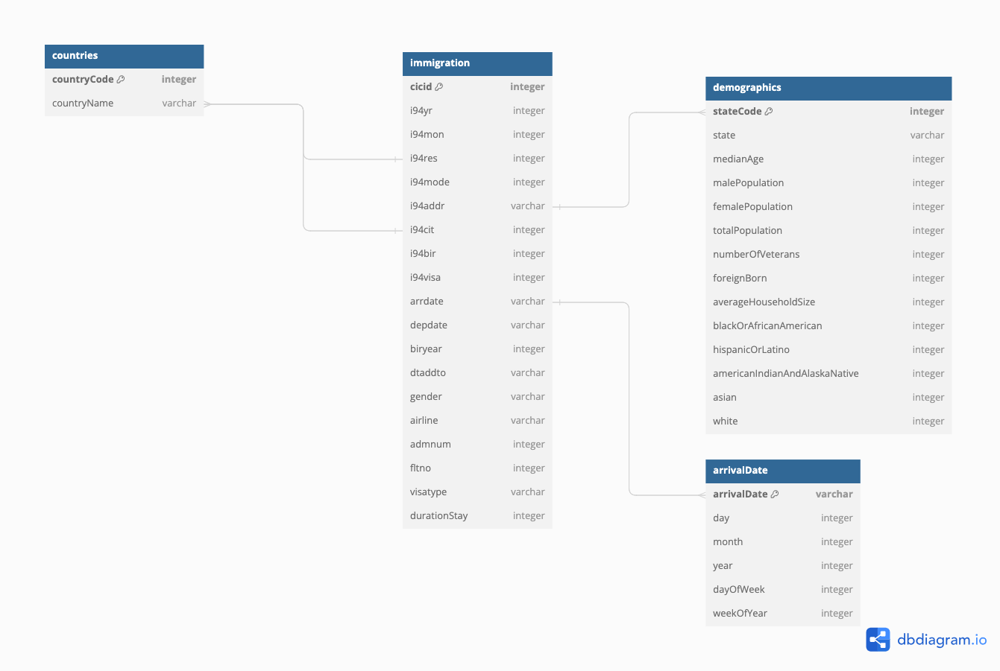

# Data Engineering Project

This project is based on the requirements of Udacity's Data Engineering Degree Capstone Project.

## Goal

In order to allow the U.S Customs & Border Protection Department to more efficiently analyze their immigration data, we are building a data warehouse infrastructure that allows to efficiently query and analyze immigration data as well as its correlation with US city demographics. 

The data warehouse provides a back-end for their Business Intelligence Tools.

It provides a data scheme to answer questions such as:
- what is the trend in the number of immigrants and their country of origin over the year?
- are their seasonal trends in the number, country of origin, and state of destination of immigrants?
- is there a correlation between the country of origin and the destination in the US?
- is there a correlation between the country of origin and the predominant race in the state of destination?
- correlation between purpose of travel and destination city / state
- what's the average stay duration?

## Data
To this end we are using the following data sources:
Data sources:
- US I94 Immigration data
- US City Demographic Data
- data labels for the I94 Immigration data from the I94_SAS_Labels_Descriptions.SAS file

## Architecture and Tools
The whole data pipeline is cloud-based and built on Amazon Web Services (AWS).

As a first step, the raw data from different sources is stored in an S3 bucket. It is then processed using Apache Spark, running on an EMR cluster. During that process, the data is loaded and transformed into a format that mirrors the structure of our data model, described further below. The data is then saved in parquet format in an S3 bucket.
In the next step, the processed data is loaded into the tables of the data model which are stored in Redshift. The process steps of 1. creating tables in Redshift, 2. loading the data from S3 to Redshift and 3. running quality checks are scheduled with Apache Airflow.

## Process steps

### 1 - Exploring the data
We first conducted an extensive data exploration to get an idea of the data and of the required filter and cleaning process. The data exploration can be found in `data_exploration.py`.

### 2 - Define the data model
The data model is set up according to a star schema. The center of the data model is the immigration data as the fact table. There are 3 dimension tables that are linked to the immigration fact table: 
1. country: contains the country names and their respective country codes as primary key. The codes are also part of the fact table
2. arrivalDate: has the arrdate of the immigration fact table as primary key. For each arrival date it splits the day, mont, year, weekofyear and dayofweek as separate values to improve the ease of doing temporal analytics
3. demographics: has the state code as primary key which can be found in i94addr in the fact table

### 3 - Run ETL to model the data
In the following, operations that were necessary to transform the raw data into a form that can be piped into the data model, are described. The code that performs these ETL operations can be found in `etl.py`. `etl.py` uses Spark to perform the extract, transform and load operations and is run on an EMR cluster.

**Immigration**
During the data exploration we identified a set of columns that are relevant for the data model. Numeric columns were turned into integer type and SAS date columns into a YYYY-MM-DD string format. Additionally, we calculated a new column: The stay duration in days, as the different of the arrival and departure date.

Based on the arrivaldate we deducted the day, month, year, weekofyear and dayofweek that were saved into an extra dataframe.

| **Column name**     | **Description**                                                                       |
|---------------------|---------------------------------------------------------------------------------------|
| cicid (int4)        | ID that uniquely identify one record in the dataset                                   |
| i94res (int4)       | 3 digit code of country of origin                                                     |
| i94mode (int4)      | Mode of arrival (1 = Air; 2 = Sea; 3 = Land; 9 = Not reported)                        |
| i94addr (varchar)   | State of arrival                                                                      |
| i94cit (int4)       | 3 digit code of city of origin                                                        |
| i94bir (int4)       | Age of Respondent in Years                                                            |
| i94visa (int4)      | Visa codes collapsed into three categories: (1 = Business; 2 = Pleasure; 3 = Student) |
| arrdate (varchar)   | Arrival date in the USA                                                               |
| depdate (varchar)   | Departure date from the USA                                                           |
| biryear (int4)      | 4 digit year of birth                                                                 |
| dtaddto (varchar)   | Character date field - Date to which admitted to US (allowed to stay until)           |
| gender (varchar)    | Non-immigrant sex                                                                     |
| airline (varchar)   | Airline used to arrive in U.S.                                                        |
| admnum (int4)       | Admission number                                                                      |
| fltno (int4)        | Flight number of Airline used to arrive in U.S.                                       |
| visatype (varchar)  | Class of admission legally admitting the non-immigrant to temporarily stay in U.S.    |
| durationStay (int4) | duration of stay in days                                                              |
| i94yr (int4)        | 4 digit year                                                                          |
| i94mon (int4)       | Numeric month                                                                         |

| **Column name**       | **Description**             |
|-----------------------|-----------------------------|
| arrivalDate (varchar) | Arrival date in the USA     |
| day (int4)            | day of arrival date         |
| month (int4)          | month of arrival date       |
| year (int4)           | year of arrival date        |
| dayOfWeek (int4)      | day of week of arrival date |

**Demographics**
We used all columns of the original demographics data and made the following transformations:
The numeric columns were turned into either integer or, when adequate, double type.

Instead of having a race and a count column (number of inhabitants of a specific race in a specific city), we pivoted the race column so that every race has its own column that indicates the number of inhabitants of that specific race. We could then also drop the count column.

The data was then aggregated per state as the immigration data indicates the destination state, but not the city.

| **Column name**                      | **Description**                                                 |
|--------------------------------------|-----------------------------------------------------------------|
| state (varchar)                      | US state                                                        |
| stateCode (varchar)                  | Two-letter state code                                           |
| malePopulation (int8)                | Male population size                                            |
| femalePopulation (int8)              | Female population size                                          |
| totalPopulation (int8)               | Total population size                                           |
| numberOfVeterans (int8)              | Number of veterans in the population                            |
| foreignBorn (int8)                   | Number of residents that were born in another city              |
| medianAge (float)                    | Median age of the population                                    |
| averageHouseholdSize (float)         | Average size of the households in the city                      |
| blackOrAfricanAmerican (int8)        | Number of inhabitants that are Black or African American        |
| americanIndianAndAlaskaNative (int8) | Number of inhabitants that are American Indian or Alaska Native |
| hispanicOrLatino (int8)              | Number of inhabitants that are Hispanic or Latino               |
| asian (int8)                         | Number of inhabitants that are Asian                            |
| white (int8)                         | Number of inhabitants that are White                            |
 
**Country labels**
In the immigration dataset the country of origin is indicated by a numeric country code. The labels for each country code can be found in a separate file, namely `I94_SAS_Labels_Descriptions.SAS`. This SAS label file was loaded as a dictionary, the country codes labels were extracted and the dictionary was turned into a dataframe of country codes and respective country names.

| **Column name**       | **Description** |
|-----------------------|-----------------|
| countryCode (int4)    | country code    |
| countryName (varchar) | country name    |

`etl.py` outputs 4 parquet files, one for each table of the data model.

We then use Apache Airflow to run a DAG that:
- creates the tables according to the data model in Redshift
- loads the cleaned data (output of `etl.py`) into the data model
- performs quality checks on each table

The code for the DAG and the operators can be found in the `/airflow` folder.

## Recommedations and assumptions
How often should the data be updated? The customer's requirements regarding how often they need an update is unclear. The parquet files are separated by month. One proposition would be a monthly update, since the parquet files delivered by the customer are partitioned by month. 

How would we approach the problem differently under the following scenarios:
If the data was increased by 100x.
--> thanks to the AWS infrastructure the pipeline is easily scalable. The number of nodes of the EMR cluster would have to be increased and the storage capacity of Redshift would have to be increased accordingly

If the pipelines were run on a daily basis by 7am.
--> we would schedule the dag to run daily at 7am

If the database needed to be accessed by 100+ people.
--> scaling up the cluster by adding more nodes to provide additional compute and storage capacity